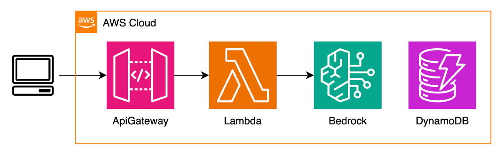
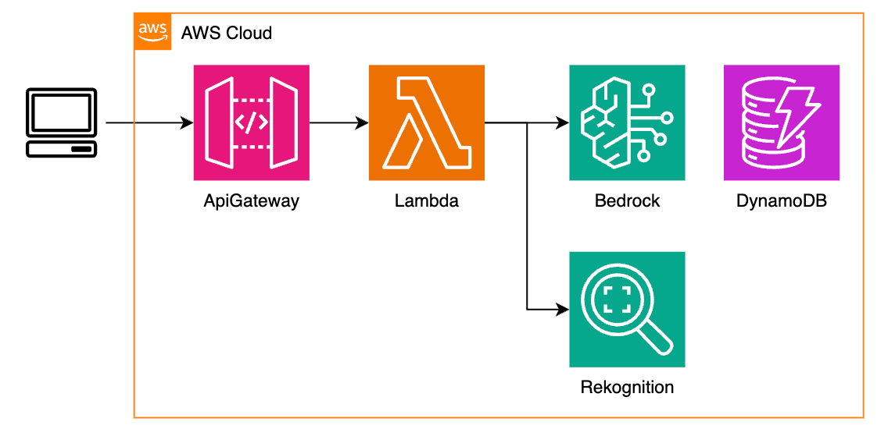
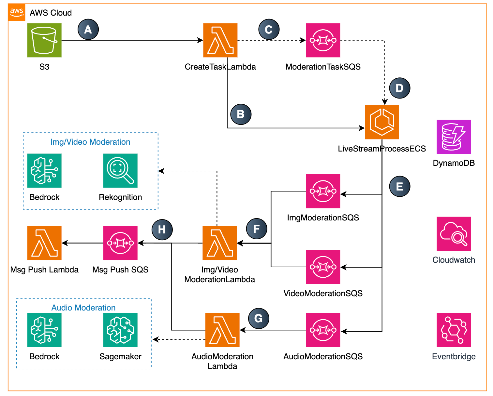
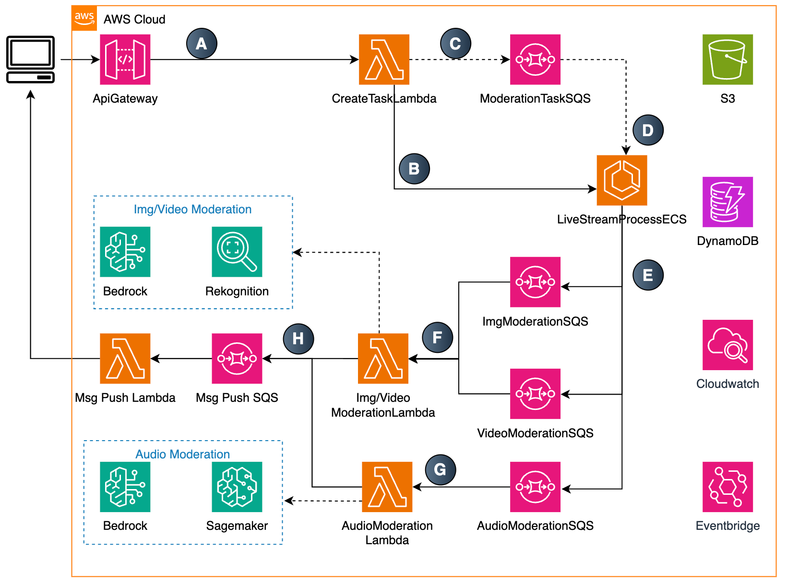

# sample-for-content-moderation

---

This solution leverages AWS services to provide comprehensive content moderation across various media types:

[中文版文档](README_CN.md)

## Text Moderation
- Implemented using Bedrock with Nova/Claude models



## Image Moderation
- Implemented using Bedrock with Nova/Claude models Or through Amazon Rekognition




## Audio, Video Moderation
- Implemented using a combination of:
  - Amazon ECS
  - Amazon SageMaker
  - Amazon Bedrock
  - Amazon Rekognition





## Live Stream Moderation
- Implemented using a combination of:
  - Amazon ECS
  - Amazon SageMaker
  - Amazon Bedrock
  - Amazon Rekognition





## Important Notice:
```
This project is a sample project solely intended to demonstrate how to implement content moderation using AWS.

This project is not prepared for production environments, so please do not use it directly in production.
```

## Code Structure & API Documentation

[Backend usage instructions](backend/README.md)

## Solution deployment

[Deployment documentation](backend_cdk_node/README.md)

## License

This project is licensed under the MIT-0 license. For details, please refer to the LICENSE file.

Some modules of this project use FFmpeg, and the source code has not been modified. FFmpeg is licensed under LGPL or GPL. For more information, please refer to the [FFmpeg official website](https://ffmpeg.org).
