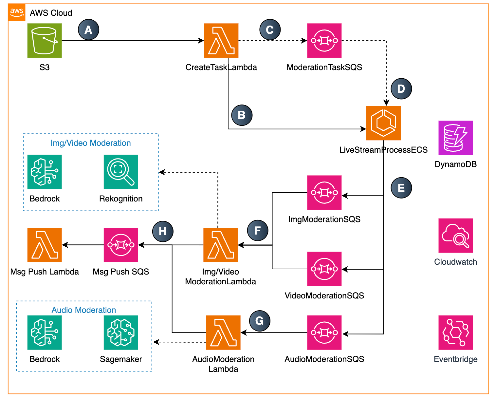
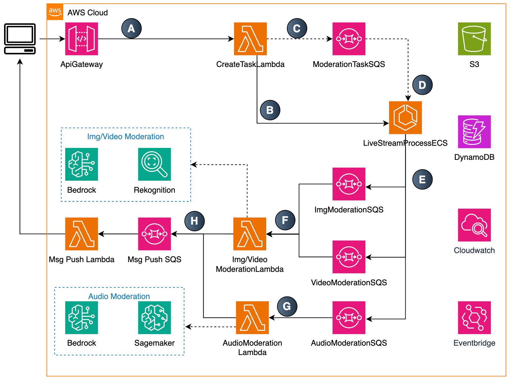

# sample-for-content-moderation  

---

该解决方案利用 AWS 服务提供全面的内容审核功能，涵盖多种媒体类型：  

[English version of the document](README.md)

## 文本审核  
- 使用 Bedrock，基于 Nova/Claude 模型实现  

  

## 图片审核  
- 使用 Bedrock，基于 Nova/Claude 模型实现，或通过 Amazon Rekognition 实现  

  

## 音频、视频审核  
- 采用以下 AWS 服务组合实现：  
  - Amazon ECS  
  - Amazon SageMaker  
  - Amazon Bedrock  
  - Amazon Rekognition  

  A. 当音频/视频文件上传到 S3 后，S3 触发 Lambda 函数。  

  B. Lambda 函数创建 ECS 任务。  

  C. Lambda 函数将审核任务信息存入 SQS。  

  ECS 任务从 SQS 获取消息并执行审核。  

  

## 直播审核  
- 采用以下 AWS 服务组合实现：  
  - Amazon ECS  
  - Amazon SageMaker  
  - Amazon Bedrock  
  - Amazon Rekognition  

  A. 通过 API Gateway 提交审核请求。  

  B. **Lambda_A** 创建 ECS 任务。  

  C. **Lambda_A** 将审核任务信息存入 **SQS_A**。  

  D. ECS 任务从 **SQS_A** 获取消息，执行审核，并将结果存入 **SQS_B**。  

  **SQS_B** 触发 **Lambda_B**，并将审核结果推送至目标服务器。  

  

## 重要声明：  
```
本项目为示例项目，仅用于演示如何使用 AWS 进行内容审核。  

该项目未经过生产环境验证，请勿直接用于生产环境。  
```  

## 代码结构 & API 文档  

[后端使用说明](backend/README_CN.md)


## 解决方案部署  

[部署文档](backend_cdk_node/README_CN.md)

## 许可证  
本项目遵循 MIT-0 许可证。详情请查看 LICENSE 文件。

本项目部分模块使用了 FFmpeg，本项目未修改其源码。FFmpeg 的许可证为 LGPL 或 GPL。更多信息请参考 [FFmpeg 官网](https://ffmpeg.org)。
